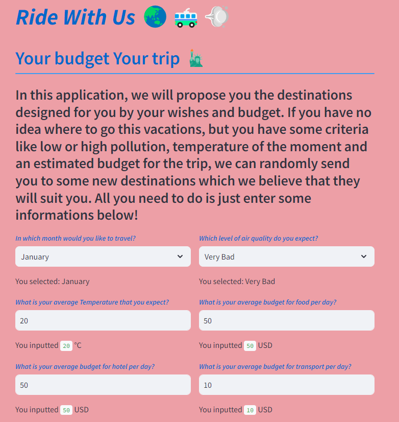
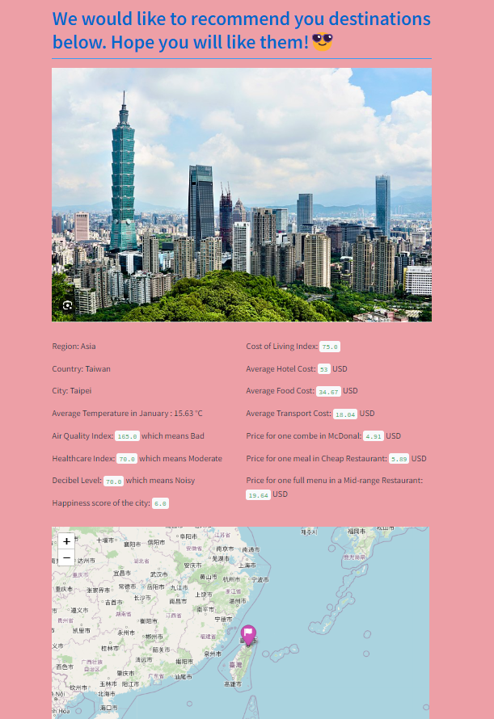
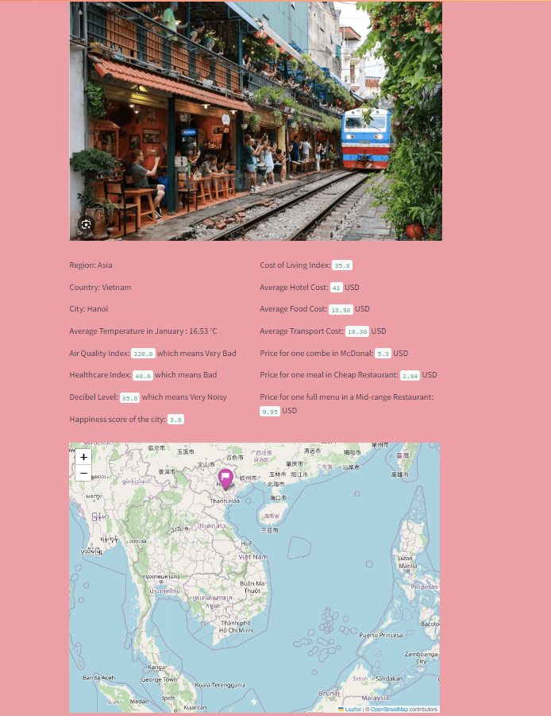
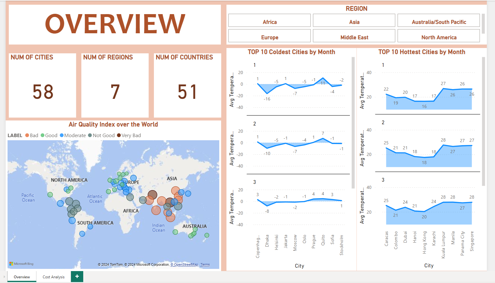
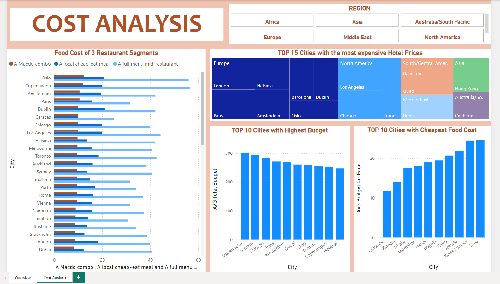

# Trip Recommendation System
#### A very short project implemented in the Intensive Course for Data Analyst at Wild Code School (2 days of work)
#### by Mai Tran

## Summary of the Project

For this project, I will have to create an application or a website offering a user the best travel destinations based on criteria that they provide.

A Trip Navigator is an online tool that allows users to create and customize their travel itineraries according to their specific preferences and needs. This tool will primarily focus on recommending destinations, randomly, while offering options to adjust some criteria as: dates, wished temperature, concerns about pollution level at destinations, and budgets.

The user needs to enter their criteria in a form directly on the site and then receives different proposals with photo and location on world map of destination.

## About the dataset:

- All the datasets can be found on kaggle.com
 City Happiness Index - 2024: (https://www.kaggle.com/datasets/emirhanai/city-happiness-index-2024)
 Cost of living per city: (https://www.kaggle.com/datasets/mvieira101/global-cost-of-living?select=cost-of-living_v2.csv)
 List of World Cities by Population Density: (https://www.kaggle.com/datasets/rajkumarpandey02/list-of-world-cities-by-population-density)
 Temperature per city: (https://www.kaggle.com/datasets/sudalairajkumar/daily-temperature-of-major-cities)

- I also used openweathermap and google to scrape the coordinates and photo of each destination in the filtered list of cities.

## Explaining step by step:
Step 1: Explore and filter all datasets. 

Step 2: Calculate the budgets using the product price of the dataset 'Cost of living per country'. 

Step 3: Scrape coordinates and photos.

Step 4: Create a Dashboard to visualize KPIs.

Step 5: Create the Recommendation Systeme using model KNN.

Step 6: Create Streamlit App for visualization of final product.

## Screenshots of the trip-navigator on Streamlit

***User Criteria Input***

***Recommend Destinations***

## Dashboard of the Project

I created a dashboard of our analysis relatied to the KPIs of the final dataset on PowerBI. In each page, there is a filter system which provides the interactive functions to all the charts.

The screenshots of the dashboard are as follows:

***1. Overview***

***2. CostAnalysis***

